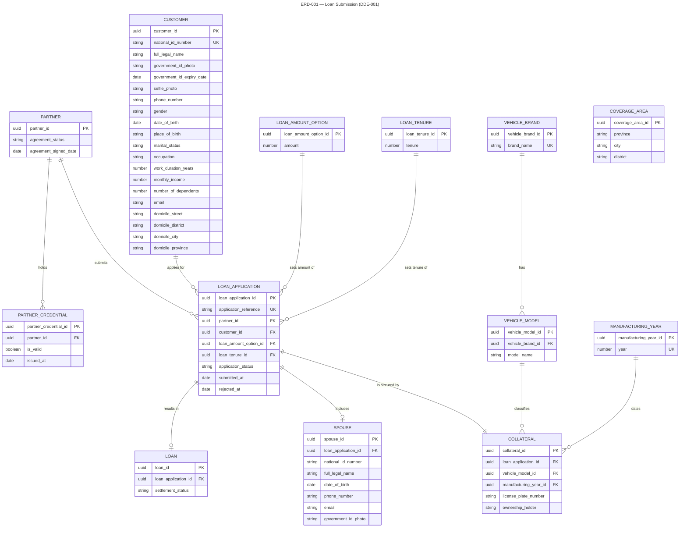

```mermaid
---
title: ERD-001 — Loan Submission (DDE-001)
---
erDiagram
    PARTNER ||--o{ PARTNER_CREDENTIAL : "holds"
    PARTNER ||--o{ LOAN_APPLICATION : "submits"
    CUSTOMER ||--o{ LOAN_APPLICATION : "applies for"
    LOAN_APPLICATION ||--o| SPOUSE : "includes"
    LOAN_APPLICATION ||--|| COLLATERAL : "is secured by"
    LOAN_APPLICATION ||--o| LOAN : "results in"
    VEHICLE_BRAND ||--o{ VEHICLE_MODEL : "has"
    VEHICLE_MODEL ||--o{ COLLATERAL : "classifies"
    MANUFACTURING_YEAR ||--o{ COLLATERAL : "dates"
    LOAN_AMOUNT_OPTION ||--o{ LOAN_APPLICATION : "sets amount of"
    LOAN_TENURE ||--o{ LOAN_APPLICATION : "sets tenure of"
    PARTNER {
        uuid partner_id PK
        string agreement_status
        date agreement_signed_date
    }
    PARTNER_CREDENTIAL {
        uuid partner_credential_id PK
        uuid partner_id FK
        boolean is_valid
        date issued_at
    }
    LOAN_APPLICATION {
        uuid loan_application_id PK
        string application_reference UK
        uuid partner_id FK
        uuid customer_id FK
        uuid loan_amount_option_id FK
        uuid loan_tenure_id FK
        string application_status
        date submitted_at
        date rejected_at
    }
    CUSTOMER {
        uuid customer_id PK
        string national_id_number UK
        string full_legal_name
        string government_id_photo
        date government_id_expiry_date
        string selfie_photo
        string phone_number
        string gender
        date date_of_birth
        string place_of_birth
        string marital_status
        string occupation
        number work_duration_years
        number monthly_income
        number number_of_dependents
        string email
        string domicile_street
        string domicile_district
        string domicile_city
        string domicile_province
    }
    SPOUSE {
        uuid spouse_id PK
        uuid loan_application_id FK
        string national_id_number
        string full_legal_name
        date date_of_birth
        string phone_number
        string email
        string government_id_photo
    }
    COLLATERAL {
        uuid collateral_id PK
        uuid loan_application_id FK
        uuid vehicle_model_id FK
        uuid manufacturing_year_id FK
        string license_plate_number
        string ownership_holder
    }
    LOAN {
        uuid loan_id PK
        uuid loan_application_id FK
        string settlement_status
    }
    VEHICLE_BRAND {
        uuid vehicle_brand_id PK
        string brand_name UK
    }
    VEHICLE_MODEL {
        uuid vehicle_model_id PK
        uuid vehicle_brand_id FK
        string model_name
    }
    MANUFACTURING_YEAR {
        uuid manufacturing_year_id PK
        number year UK
    }
    LOAN_AMOUNT_OPTION {
        uuid loan_amount_option_id PK
        number amount
    }
    LOAN_TENURE {
        uuid loan_tenure_id PK
        number tenure
    }
    COVERAGE_AREA {
        uuid coverage_area_id PK
        string province
        string city
        string district
    }
```
