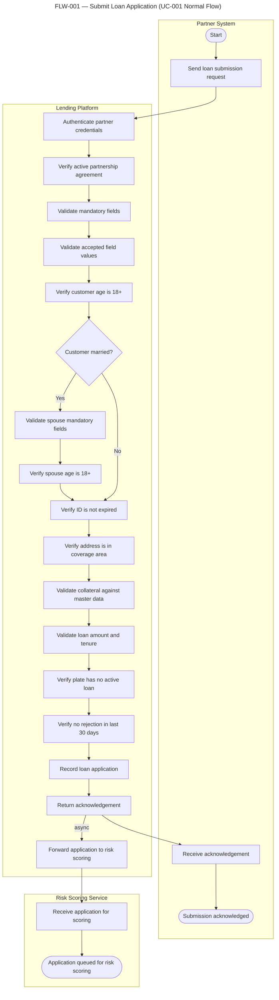

```mermaid
---
title: FLW-001 — Submit Loan Application (UC-001 Normal Flow)
---
flowchart TB
    subgraph PS["Partner System"]
        start([Start])
        p1[Send loan submission request]
        p2[Receive acknowledgement]
        endAck([Submission acknowledged])
    end

    subgraph LP["Lending Platform"]
        l1[Authenticate partner credentials]
        l2[Verify active partnership agreement]
        l3[Validate mandatory fields]
        l4[Validate accepted field values]
        l5[Verify customer age is 18+]
        d1{Customer married?}
        a1[Validate spouse mandatory fields]
        a2[Verify spouse age is 18+]
        l6[Verify ID is not expired]
        l7[Verify address is in coverage area]
        l8[Validate collateral against master data]
        l9[Validate loan amount and tenure]
        l10[Verify plate has no active loan]
        l11[Verify no rejection in last 30 days]
        l12[Record loan application]
        l13[Return acknowledgement]
        l14[Forward application to risk scoring]
    end

    subgraph RS["Risk Scoring Service"]
        r1[Receive application for scoring]
        endScore([Application queued for risk scoring])
    end

    start --> p1 --> l1 --> l2 --> l3 --> l4 --> l5 --> d1
    d1 -- Yes --> a1 --> a2 --> l6
    d1 -- No --> l6
    l6 --> l7 --> l8 --> l9 --> l10 --> l11 --> l12 --> l13
    l13 --> p2 --> endAck
    l13 -- async --> l14 --> r1 --> endScore
```
