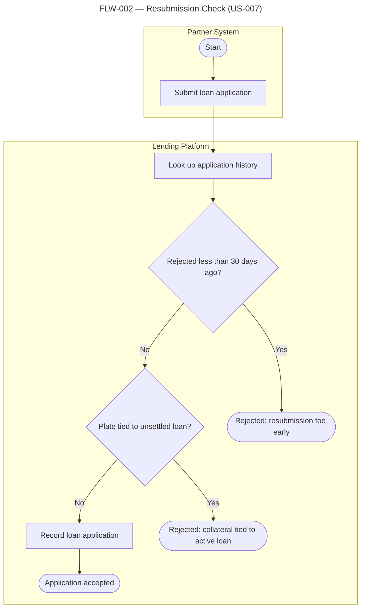

```mermaid
---
title: FLW-002 — Resubmission Check (US-007)
---
flowchart TB
    subgraph PS["Partner System"]
        start([Start])
        p1[Submit loan application]
    end
    subgraph LP["Lending Platform"]
        l1[Look up application history]
        d1{Rejected less than 30 days ago?}
        d2{Plate tied to unsettled loan?}
        l2[Record loan application]
        rj1([Rejected: resubmission too early])
        rj2([Rejected: collateral tied to active loan])
        ok([Application accepted])
    end
    start --> p1 --> l1 --> d1
    d1 -- Yes --> rj1
    d1 -- No --> d2
    d2 -- Yes --> rj2
    d2 -- No --> l2 --> ok
```
