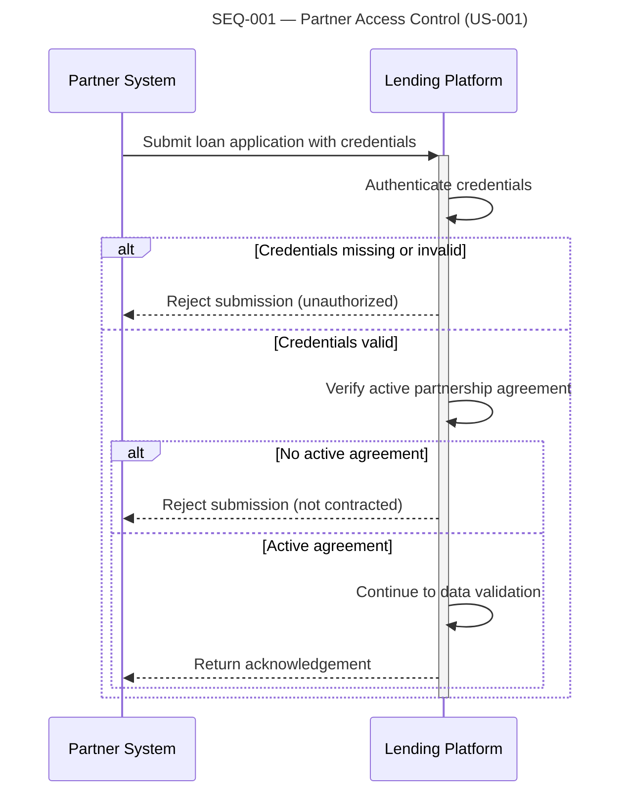

```mermaid
---
title: SEQ-001 — Partner Access Control (US-001)
---
sequenceDiagram
    participant PS as Partner System
    participant LP as Lending Platform

    PS->>+LP: Submit loan application with credentials
    LP->>LP: Authenticate credentials
    alt Credentials missing or invalid
        LP-->>PS: Reject submission (unauthorized)
    else Credentials valid
        LP->>LP: Verify active partnership agreement
        alt No active agreement
            LP-->>PS: Reject submission (not contracted)
        else Active agreement
            LP->>LP: Continue to data validation
            LP-->>PS: Return acknowledgement
        end
    end
    deactivate LP
```
