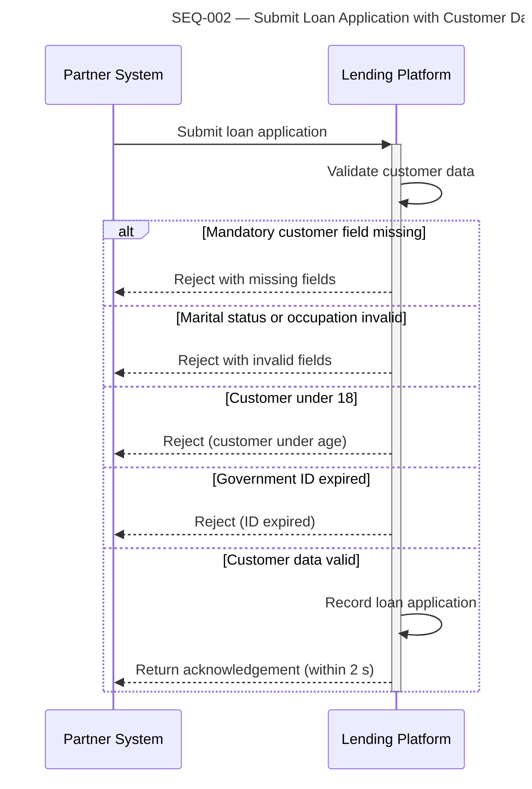

```mermaid
---
title: SEQ-002 — Submit Loan Application with Customer Data (US-002)
---
sequenceDiagram
    participant PS as Partner System
    participant LP as Lending Platform

    PS->>+LP: Submit loan application
    LP->>LP: Validate customer data
    alt Mandatory customer field missing
        LP-->>PS: Reject with missing fields
    else Marital status or occupation invalid
        LP-->>PS: Reject with invalid fields
    else Customer under 18
        LP-->>PS: Reject (customer under age)
    else Government ID expired
        LP-->>PS: Reject (ID expired)
    else Customer data valid
        LP->>LP: Record loan application
        LP-->>PS: Return acknowledgement (within 2 s)
    end
    deactivate LP
```
