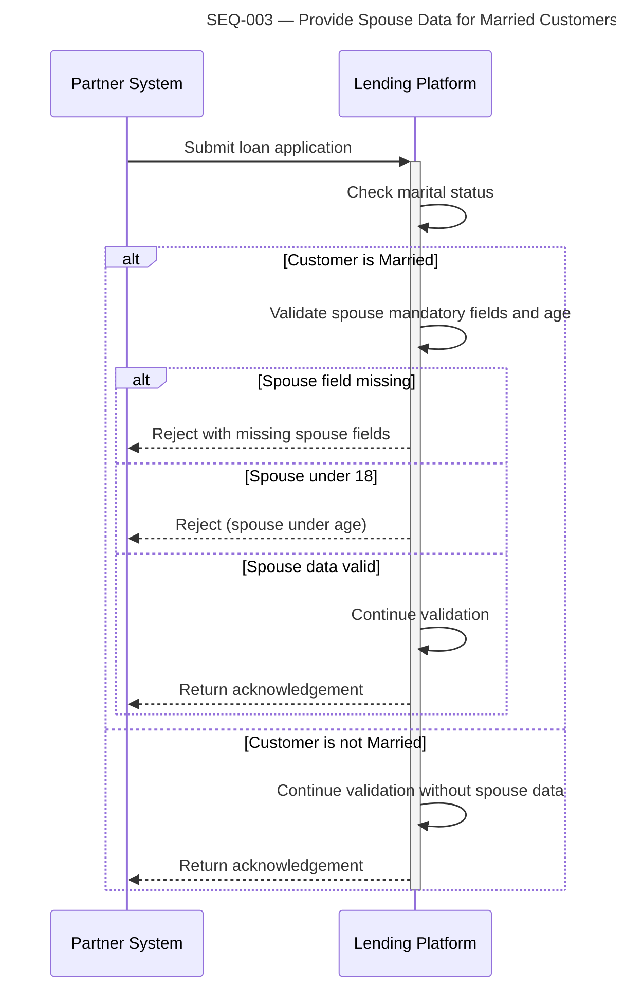

```mermaid
---
title: SEQ-003 — Provide Spouse Data for Married Customers (US-003)
---
sequenceDiagram
    participant PS as Partner System
    participant LP as Lending Platform

    PS->>+LP: Submit loan application
    LP->>LP: Check marital status
    alt Customer is Married
        LP->>LP: Validate spouse mandatory fields and age
        alt Spouse field missing
            LP-->>PS: Reject with missing spouse fields
        else Spouse under 18
            LP-->>PS: Reject (spouse under age)
        else Spouse data valid
            LP->>LP: Continue validation
            LP-->>PS: Return acknowledgement
        end
    else Customer is not Married
        LP->>LP: Continue validation without spouse data
        LP-->>PS: Return acknowledgement
    end
    deactivate LP
```
