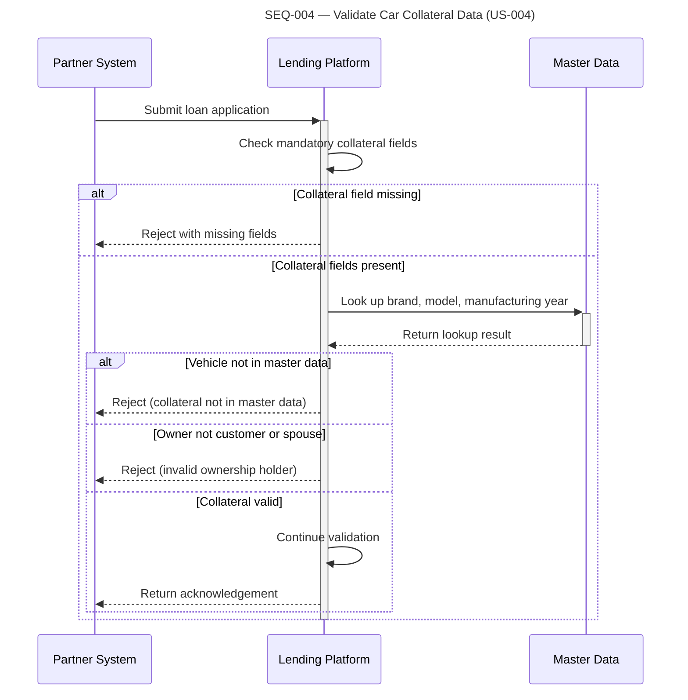

```mermaid
---
title: SEQ-004 — Validate Car Collateral Data (US-004)
---
sequenceDiagram
    participant PS as Partner System
    participant LP as Lending Platform
    participant MD as Master Data

    PS->>+LP: Submit loan application
    LP->>LP: Check mandatory collateral fields
    alt Collateral field missing
        LP-->>PS: Reject with missing fields
    else Collateral fields present
        LP->>+MD: Look up brand, model, manufacturing year
        MD-->>-LP: Return lookup result
        alt Vehicle not in master data
            LP-->>PS: Reject (collateral not in master data)
        else Owner not customer or spouse
            LP-->>PS: Reject (invalid ownership holder)
        else Collateral valid
            LP->>LP: Continue validation
            LP-->>PS: Return acknowledgement
        end
    end
    deactivate LP
```
