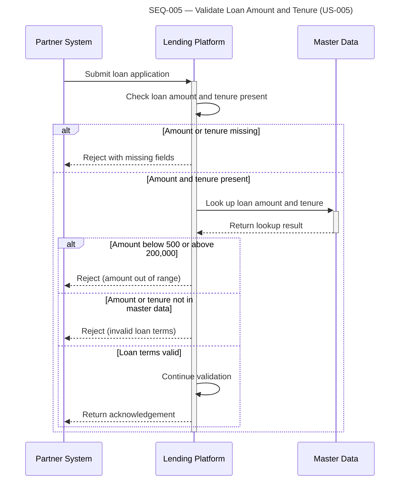

```mermaid
---
title: SEQ-005 — Validate Loan Amount and Tenure (US-005)
---
sequenceDiagram
    participant PS as Partner System
    participant LP as Lending Platform
    participant MD as Master Data

    PS->>+LP: Submit loan application
    LP->>LP: Check loan amount and tenure present
    alt Amount or tenure missing
        LP-->>PS: Reject with missing fields
    else Amount and tenure present
        LP->>+MD: Look up loan amount and tenure
        MD-->>-LP: Return lookup result
        alt Amount below 500 or above 200,000
            LP-->>PS: Reject (amount out of range)
        else Amount or tenure not in master data
            LP-->>PS: Reject (invalid loan terms)
        else Loan terms valid
            LP->>LP: Continue validation
            LP-->>PS: Return acknowledgement
        end
    end
    deactivate LP
```
