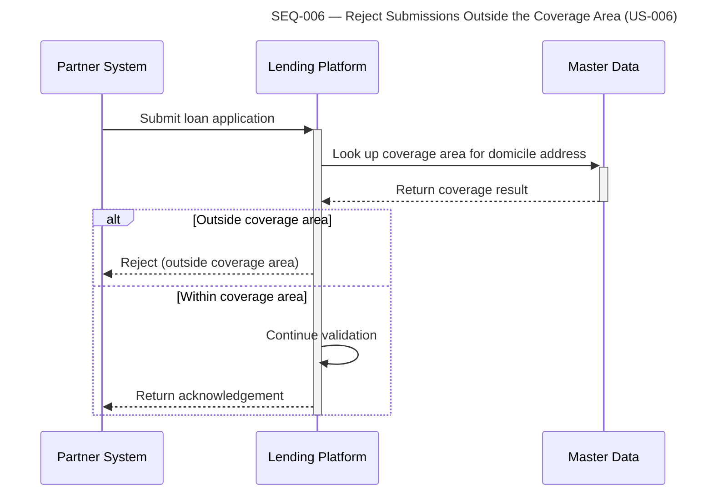

```mermaid
---
title: SEQ-006 — Reject Submissions Outside the Coverage Area (US-006)
---
sequenceDiagram
    participant PS as Partner System
    participant LP as Lending Platform
    participant MD as Master Data

    PS->>+LP: Submit loan application
    LP->>+MD: Look up coverage area for domicile address
    MD-->>-LP: Return coverage result
    alt Outside coverage area
        LP-->>PS: Reject (outside coverage area)
    else Within coverage area
        LP->>LP: Continue validation
        LP-->>PS: Return acknowledgement
    end
    deactivate LP
```
