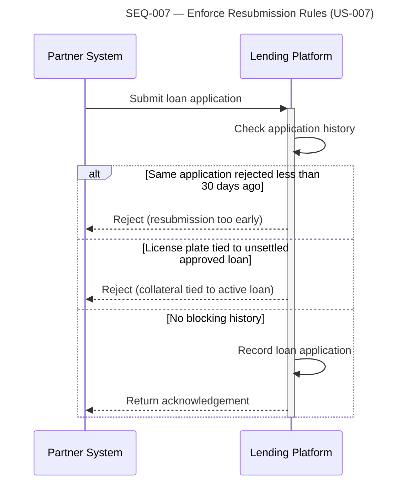

```mermaid
---
title: SEQ-007 — Enforce Resubmission Rules (US-007)
---
sequenceDiagram
    participant PS as Partner System
    participant LP as Lending Platform

    PS->>+LP: Submit loan application
    LP->>LP: Check application history
    alt Same application rejected less than 30 days ago
        LP-->>PS: Reject (resubmission too early)
    else License plate tied to unsettled approved loan
        LP-->>PS: Reject (collateral tied to active loan)
    else No blocking history
        LP->>LP: Record loan application
        LP-->>PS: Return acknowledgement
    end
    deactivate LP
```
