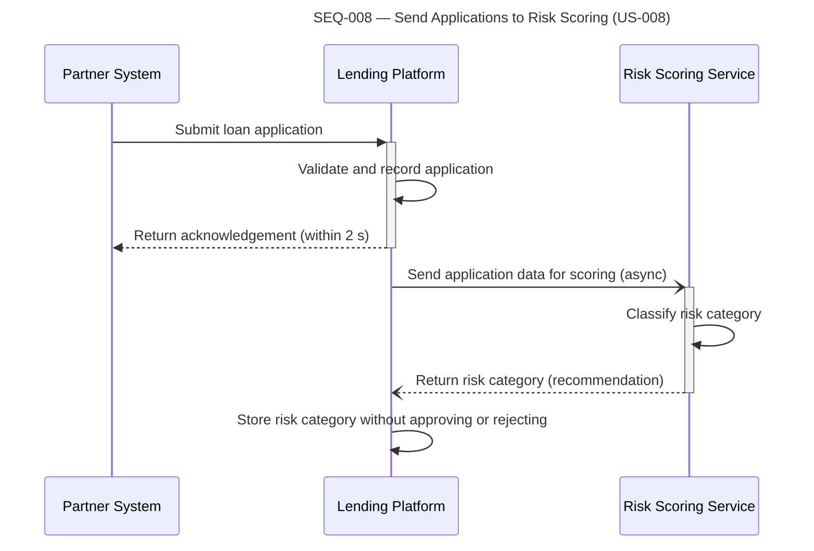

```mermaid
---
title: SEQ-008 — Send Applications to Risk Scoring (US-008)
---
sequenceDiagram
    participant PS as Partner System
    participant LP as Lending Platform
    participant RS as Risk Scoring Service

    PS->>+LP: Submit loan application
    LP->>LP: Validate and record application
    LP-->>-PS: Return acknowledgement (within 2 s)
    LP-)+RS: Send application data for scoring (async)
    RS->>RS: Classify risk category
    RS--)-LP: Return risk category (recommendation)
    LP->>LP: Store risk category without approving or rejecting
```
