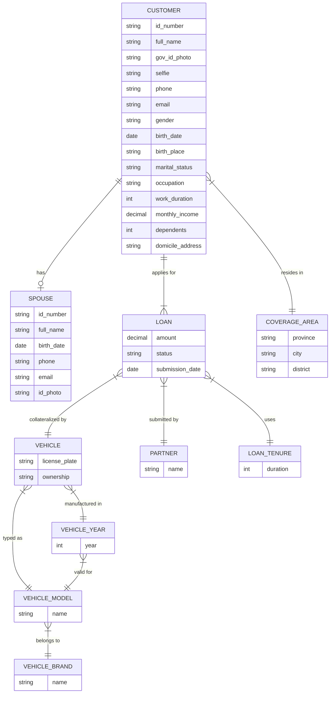

```mermaid
erDiagram
    CUSTOMER {
        string id_number
        string full_name
        string gov_id_photo
        string selfie
        string phone
        string email
        string gender
        date birth_date
        string birth_place
        string marital_status
        string occupation
        int work_duration
        decimal monthly_income
        int dependents
        string domicile_address
 }

    SPOUSE {
        string id_number
        string full_name
        date birth_date
        string phone
        string email
        string id_photo
 }

    VEHICLE {
        string license_plate
        string ownership
 }

    LOAN {
        decimal amount
        string status
        date submission_date
 }

    PARTNER {
        string name
 }

    VEHICLE_BRAND {
        string name
 }

    VEHICLE_MODEL {
        string name
 }

    VEHICLE_YEAR {
        int year
 }

    LOAN_TENURE {
        int duration
 }

    COVERAGE_AREA {
        string province
        string city
        string district
 }

    CUSTOMER ||--o| SPOUSE : "has"
    CUSTOMER ||--|{ LOAN : "applies for"
    CUSTOMER }|--|| COVERAGE_AREA : "resides in"
    LOAN }|--|| VEHICLE : "collateralized by"
    LOAN }|--|| PARTNER : "submitted by"
    LOAN }|--|| LOAN_TENURE : "uses"
    VEHICLE }|--|| VEHICLE_MODEL : "typed as"
    VEHICLE }|--|| VEHICLE_YEAR : "manufactured in"
    VEHICLE_MODEL }|--|| VEHICLE_BRAND : "belongs to"
    VEHICLE_YEAR }|--|| VEHICLE_MODEL : "valid for"
```
